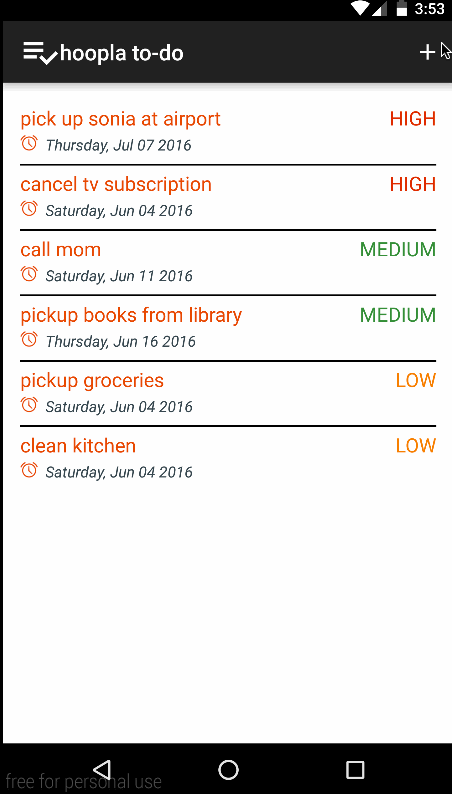

# Pre-work - Hoopla

Hoopla is an android app that allows building a todo list and basic todo items management functionality including adding new items, editing and deleting an existing item.

Submitted by: Santosh A Gogi

Time spent: 25 hours spent in total

## User Stories

**Version 1.0**
The following **required** functionality is completed:

* [Y] User can **successfully add and remove items** from the todo list
* [Y] User can **tap a todo item in the list and bring up an edit screen for the todo item** and then have any changes to the text reflected in the todo list.
* [Y] User can **persist todo items** and retrieve them properly on app restart

The following **optional** features are implemented:

* [Y] Persist the todo items [into SQLite](http://guides.codepath.com/android/Persisting-Data-to-the-Device#sqlite) instead of a text file
* [Y] Improve style of the todo items in the list [using a custom adapter](http://guides.codepath.com/android/Using-an-ArrayAdapter-with-ListView)
* [Y] Add support for completion due dates for todo items (and display within listview item)
* [Y] Use a [DialogFragment](http://guides.codepath.com/android/Using-DialogFragment) instead of new Activity for editing items
* [Y] Add support for selecting the priority of each todo item (and display in listview item)
* [Y] Tweak the style improving the UI / UX, play with colors, images or backgrounds

**Version 2.0**
* [Y] Geofencing - Set a location to a task and get notification if you are near that location
* [Y] Google Maps navigation to a task location
* [Y] Improved UI/UX

## Video Walkthrough 

Here's a walkthrough of implemented user stories:

**Version 1.0**

**Version 2.0**

GIF created with [LiceCap](http://www.cockos.com/licecap/).

## Notes

Overall, had a really interesting time coding the app.

Challenges faced.
- Had quite a few difficulties working with layouts.
- activeandroid ORM does not have any online support. Issue - Date object is not deserialized correctly.
- backward compatibility of material themes to API 16 since material design was introduced in later API version (I think API 21) could not be done.

## License

    Copyright 2015 Santosh A Gogi

    Licensed under the Apache License, Version 2.0 (the "License");
    you may not use this file except in compliance with the License.
    You may obtain a copy of the License at

        http://www.apache.org/licenses/LICENSE-2.0

    Unless required by applicable law or agreed to in writing, software
    distributed under the License is distributed on an "AS IS" BASIS,
    WITHOUT WARRANTIES OR CONDITIONS OF ANY KIND, either express or implied.
    See the License for the specific language governing permissions and
    limitations under the License.
